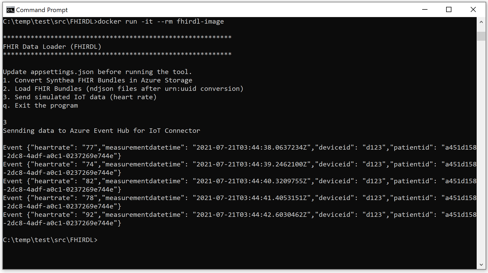
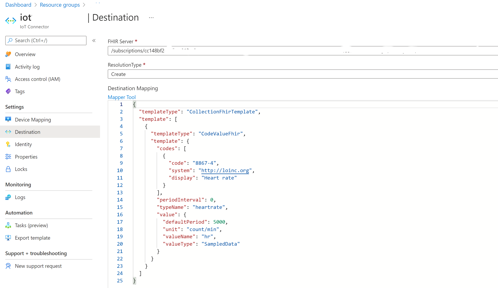
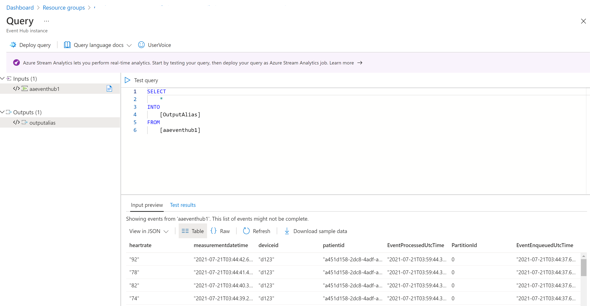

# Access Data in the Healthcare APIs

You can access the Healthcare APIs in your applications and tools such as Postman and the Rest Client extension in Visual Studio Code.

>[!Note]
>Make sure you have installed the [Rest Client](/docs/HowToUseRestClient.md) extension in Visual Studio Code).

## Access the FHIR service with Rest Client

Verify that you have grant "FHIR Data Contributor" or other roles to the client appliation or the user.

- Replace the xxx values in the FHIR data access [file](/src/scripts/fhirdata.http)

```
    @fhiraudience=xxx
    @clientid=xxx
    @clientsecret=xxx
    @tenantid=xxx
```

- Obtain an access token by clicking on the "Send Request" right above 
`
    POST https://login.microsoftonline.com/{{tenantid}}/oauth2/token
`

You can now get patient data, export data, create/update patient data, etc.

## Access the DICOM service with Rest Client

Verify that you have granted "DICOM Data Owner" or other roles to the client app or user. 

- Replace the xxx values in the DICOM data access [file](/src/scripts/dicomdata.http)

```
    @resourcegroupname=xxx
    @workspacename=xxx
    @dicomservicename=xxx
    @location=xxx
    @subscriptionid=xxx
    @tenantid=xxx
    @clientid=xxx
    @clientsecret=xxx
    @resource=https://management.azure.com/
    @authorityurl=https://login.microsoftonline.com
    @apiversion=2020-11-01-preview
```

- Obtain an access token by clicking on the "Send Request" right above. 
`
    POST https://login.microsoftonline.com/{{tenantid}}/oauth2/token
`
- Alternatively, you can run the cli cmdlet to get an access token. Note that the authority used to obtain the token is the same for all DICOM services. 
  
`
    az account get-access-token --resource=https://dicom.healthcareapis.azure.com/ --query accessToken --output tsv
`

You are now ready to send images to the DICOM service and check feed change. Only compatible images can be saved to the service.

## Send simulated device data to the IoT Connector

You can use one option in the standalone tool to send simulated heart rate data to the IoT Connector. 



- Configure and run the standalone tool as described [here](/docs/HowToLoadData.md)
- Optionally, you can change the destination mapping so that all individual events (or readings) are processed and loaded to the FHIR service.
  `
    "periodInterval": 0
  `
   Without the change, only one set of generated events is processed every 60 minutes. See more details on [configuration and mapping](https://github.com/microsoft/iomt-fhir/blob/master/docs/Configuration.md).



- View the device data from the Azure event hub in your subscription.



- View the Observation data in the FHIR service. See more details on [Access Data in the Healthcare APIs](/docs/HowToAccessData.md).

```
{
  "resourceType": "Observation",
  "id": "6b61df96-ffcd-4bd3-b200-526586b6a076",
  "meta": {
    "versionId": "1",
    "lastUpdated": "2021-07-14T22:34:58.973+00:00"
  },
  "identifier": [
    {
      "system": "https://azure.microsoft.com/en-us/services/iomt-fhir-connector/",
      "value": "a451d158-2dc8-4adf-a0c1-0237269e744e.9b0d3384-1534-4cf3-81fd-209906edc85c.heartrate.20210714220000Z.20210714225959Z"
    }
  ],
  "status": "final",
  "code": {
    "coding": [
      {
        "system": "http://loinc.org",
        "code": "8867-4",
        "display": "Heart rate"
      },
      {
        "system": "https://azure.microsoft.com/en-us/services/iomt-fhir-connector/",
        "code": "heartrate",
        "display": "heartrate"
      }
    ],
    "text": "heartrate"
  },
  "subject": {
    "reference": "Patient/a451d158-2dc8-4adf-a0c1-0237269e744e"
  },
  "effectivePeriod": {
    "start": "2021-07-14T22:00:00.0000000Z",
    "end": "2021-07-14T22:59:59.9999999Z"
  },
  "issued": "2021-07-14T22:34:58.3181863+00:00",
  "device": {
    "reference": "Device/9b0d3384-1534-4cf3-81fd-209906edc85c"
  }
}
```