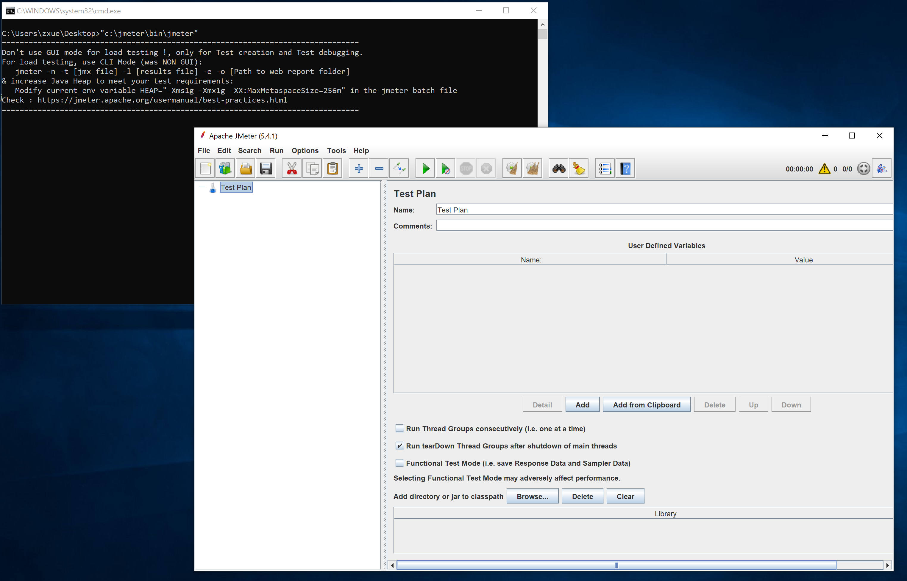
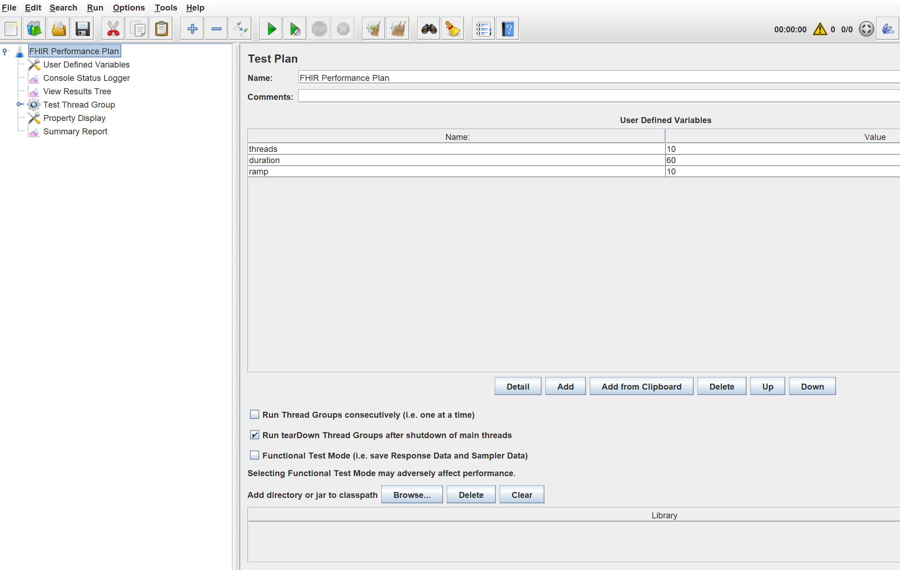
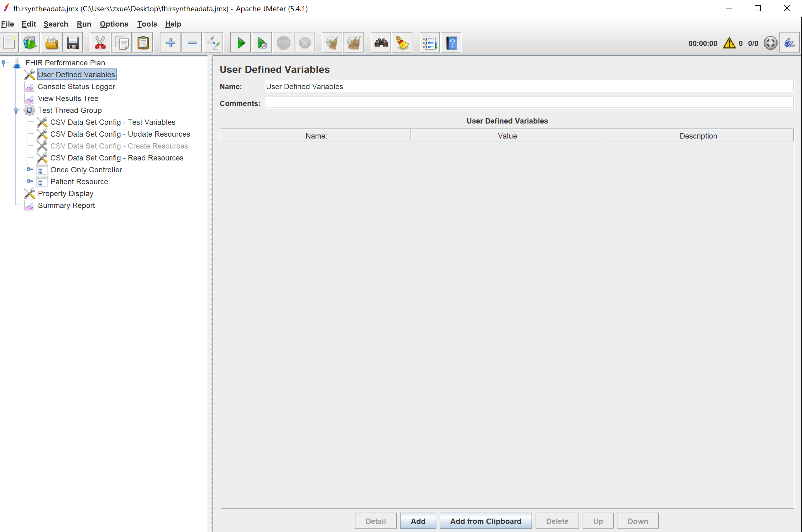
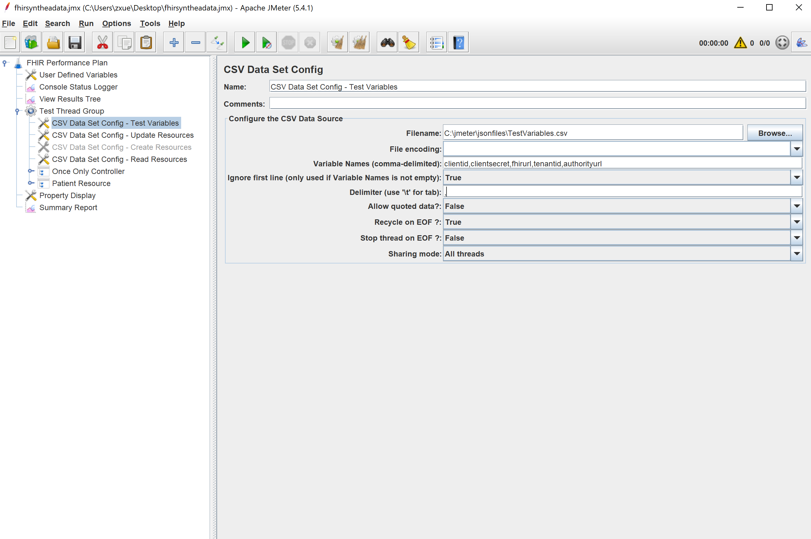
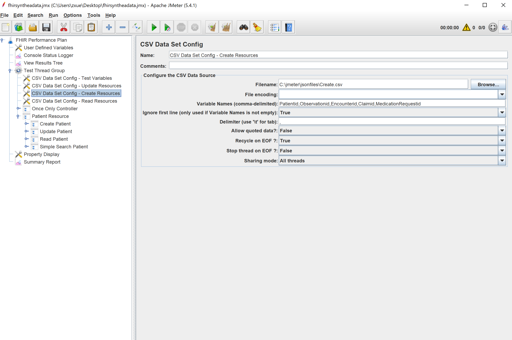
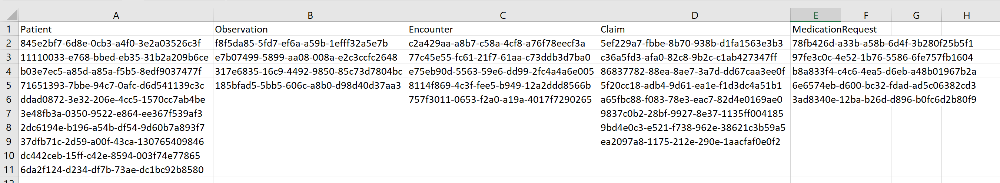
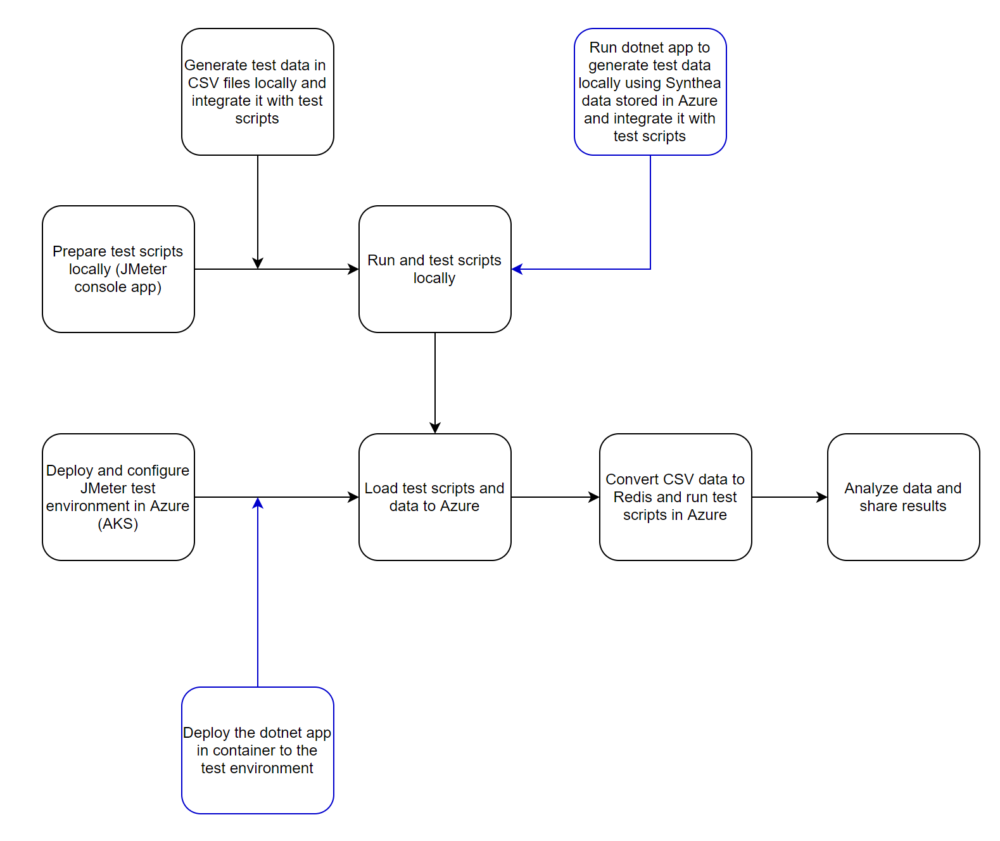
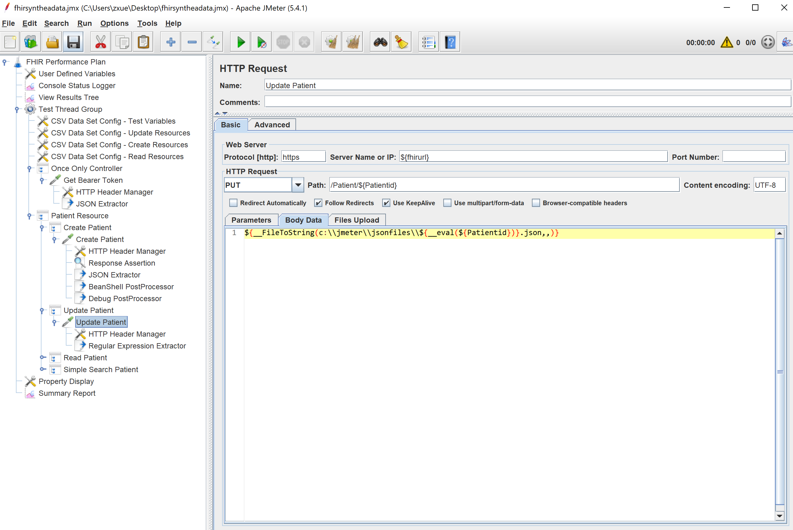
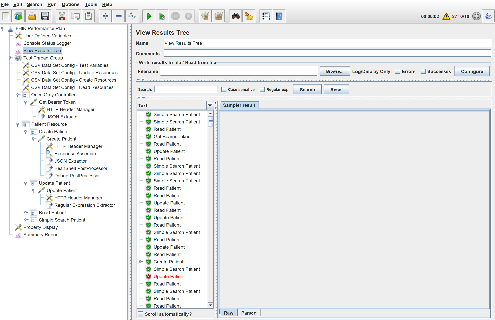
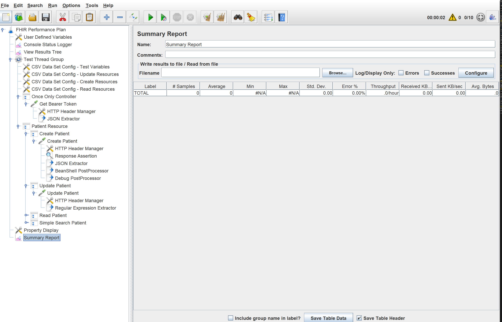

# How to Run Performance Test using JMeter

You can use any performance test tools including open source projects such as [JMeter](https://jmeter.apache.org/). This document covers the performance test using JMeter.

You can create testing scripts and run tests locally using the JMeter, download the JMeter tool and run it on Windows or Linux or other operating systems it supports.

## Start JMeter on Windows

Below is the command to start the JMeter application on Windows, assuming the tool is installed in the jmeter root directory.

`
"c:\jmeter\bin\jmeter"
`



## Run JMeter Tests on Windows

In order to test HealthcareAPIs, you'll need to create a test script.

- Define a test plan, and specify threads, duration, ramp.
- Define variables in csv files.
- Generate test data for FHIR resources e.g. Patient. One option is to use a sample json file and replace resource ids stored in csv files. Another option is to use Synthea data directly and store Synthea json file names in the csv file.
- Get an Azure AD access token. Ideally you want to get the token within the script, rather than copying and pasting the token string. 
- Define the mix of CRUD operations, including Create, Read, Update, Delete. Search is a variation of the Read operation and often involves one or multiple parameters, also known as advanced search. For the mix, as an example you may choose to create a test run with 10% Create, 40% Read, 20% Update and 30% Search.
- Test the script locally
- Run the test locally
- Run the tests in Azure AKS

### Define a Test Plan

The test plan defined in the fhirsynthea.jmx file specifies the threads, duration and ramp, and read, update and search mix.



### Define Variables

You can define global variables using "User Defined Variables", as shown below. They are not used in the sample test plan.



Also, you can define variables in the csv data catalog, with values contained in the csv file. Note that you can include a header row in the csv file but the variables are actually specified in the data catalog and the header row is skipped when JMeter reads the data.  

For example, the following variables are defined for getting an Azure access token.

`
clientid,clientsecret,fhirurl,tenantid,authorityurl
`
Variables defined in data catalog



Values contained in cvs file, delimited by comma ','.


Similarly, you can specify variables and values for the CRUD operations.

`
Patientid,Observationid,Encounterid,Claimid,MedicationRequestid
`

Variables defined in data catalog



Values contained in cvs file, delimited by comma ','.




 ### Generate test data 

JMeter allows you to include text or one or multiple json files in HTTP requests. When using text, you can include variables in it and replace it with values stored in the csv files. When using json files, you can include json file names in the csv files which will be loaded during the test.



The FHIR test data generator helps automate the process of generating test data, including json files and csv files containing json file names. It downloads json files stored in Azure storage and generate "create.csv", "read.csv", "update.csv" and "delete.csv" files. Each file contains resource ids for a resource type, e.g. Patient or Claim.

More details on the [FHIRTDG](HowToUseFHIRTDG.md).

### Get an Azure AD Access Token

Use the "Only Once Controller" module and defined variables to get Azure AD access token.


### Define CRUD Operations

Use the HTTP module to specify the method, the fhir url, and the json files to be used. 



Each json file named with the resource id contains the full resource data. JMeter reads the resource ids, e.g. Patient, and for the "Create" or "Update" operation load the json file that matches the resource based on the id value. Other operations, Read or Delete, do not require request body.

The __FileToString does the mapping and translation. 

`
${__FileToString(c:\\jmeter\\jsonfiles\\${__eval(${Patientid})}.json,,)}
`
Note that the local Windows directory is specified in the function. It should have a different value for Linux.

Use the Throughput module to specify the throughput value in %, e.g. 20. This value tells JMeter how often this specific operation should run during the test.

### Test the Script Locally

Once the test script is ready, you can run it in the application. Note that you should only use the option to ensure the script is working properly. You can the command line without the UI to obtain accurate test results.

You can use the "View Results Tree" module to see what's going on.



Also, you can see the summary report.



### Run the test locally

You can run quick tests locally on your PC or VM in the cloud. 

Locate the files in the jmeter folder.
Place the jmx file (e.g. [fhirsyntheadata.jmx](/docs/jmeter/fhirsyntheadata.jmx)) and the csv file with variables (e.g. [testvariables.csv](/docs/jmeter/testvariables.csv)) to a local folder (e.g. jsonfiles under jmeter on Windows) and run the command line below.

```
del jmeterreport.csv
rmdir /s /q htmlreport

c:\jmeter\bin\jmeter -n -t c:\jmeter\jsonfiles\fhirsyntheadata.jmx -l  c:\jmeter\jsonfiles\jmeterreport.csv -e -o  c:\jmeter\jsonfiles\HtmlReport
```

When the command line is completed, you can navigate to the  HtmlReport folder, and open the index.html file to view the test results.

### Run the tests in Azure AKS
  
To run performance tests in Azure AKS, you can deploy an AKS cluster in Azure, load and run the test script, and analyze the test results.

You can find more info at the github repo [Public Test Projects](https://github.com/ShadowPic/PublicTestProjects).
